# Git from the inside out

This essay shows you how Git works.  It focuses on the graph that underpins Git and how the properties of this graph dictate the behaviors of Git.  This focus on fundamentals lets you build your mental model on the truth, rather than on hypotheses constructed from evidence gathered while experimenting with the API.  This truer model gives you a better understanding of what Git has done, what it is doing and what it will do.

The text is structured as a series of Git commands run on a single project.  At intervals, there are observations about the graph data structure that Git is built on.  These observations illustrate a property of the graph and the behavior that this property produces.

It is assumed that you understand Git well enough to use it to version control your projects.

## Create a project

```bash
~ $ mkdir alpha
~ $ cd alpha
```

The user creates `alpha`, a directory for their project.

```bash
~/alpha $ mkdir data
~/alpha $ printf 'a' > data/letter.txt
```

They move into the `alpha` directory and create a directory called `data`.  Inside, they create a file called `letter.txt` that contains `a`.  The alpha directory looks like this:

```
alpha
└── data
    └── letter.txt
```

# Initialize a repository

```bash
~/alpha $ git init
          Initialized empty Git repository
```

`git init` turns the current directory into a Git repository.  To do this, it creates a `.git` directory and writes some files to it.  These files define everything about the configuration and history of a project.  They are just ordinary files.  No magic in them.  The user can read and change them with a text editor or shell.  Which is to say: the user can read and edit the history of their project as easily as their project files.

The `alpha` directory now looks like this:

```
alpha
├── data
|   └── letter.txt
└── .git
    ├── objects
    etc...
```


The `.git` directory and its contents are Git's.  All the other files are collectively known as the working copy.  They are the user's.

## Add some files

```
~/alpha $ git add data/letter.txt
```

The user runs `git add` on the `data/letter.txt` file.  This has two effects.

First, it creates a new blob file in the directory at `alpha/.git/objects/`.

This file contains the compressed content of the `data/letter.txt` file.

The name of this file is derived by hashing the file's content.  Hashing a piece of text means running a program on it that turns it into a smaller[^1] piece of text that uniquely[^2] identifies the original.  For example, Git hashes `a` to `5e40c0877058c504203932e5136051cf3cd3519b`.  This hash is a short, unique identifier for the current content of `number.txt`.  The first two characters are used as the name of a directory inside `alpha/.git/objects/`: `5e`.  The rest of the hash is used as the name of the file that holds the content of added file: `40c0877058c504203932e5136051cf3cd3519b`.

Notice how just adding a file to Git saves its content to the objects directory.  If the user were to delete the `data/letter.txt` file the working copy, its content would still be safe inside Git.

Second, `git add` adds the file to the index.  The index is a list that contains every file that Git has been told to keep track of.  It is just a file that lives at `alpha/.git/index`. Each line of the file maps a tracked file to a hash of its content at the moment it was added.

```
data/letter.txt 5e40c0877058c504203932e5136051cf3cd3519b
```

```bash
~/alpha $ printf '1234' > data/number.txt
```

The user makes a file called `data/number.txt` that contains `1234`.  The working copy looks like this:

```text
alpha
└── data
    └── letter.txt
    └── number.txt
```

```bash
~/alpha $ git add data
```

The user adds the file to Git.  This creates a blob file that contains the content of `data/number.txt`.  And it adds another index entry that maps the `data/number.txt` file to a hash of its content.

```
data/letter.txt 5e40c0877058c504203932e5136051cf3cd3519b
data/number.txt 274c0052dd5408f8ae2bc8440029ff67d79bc5c3
```

Note that, though the user ran `git add data`, only the files in the `data` directory are listed.  The `data` directory is not listed separately.

```bash
~/alpha $ printf '1' > data/number.txt
~/alpha $ git add data
```

When the user originally created `data/number.txt`, they meant to type `1`, not `1234`.  They make the correction and add the file to the index again.  This creates a new blob with the new content.  It updates the index entry for `data/number.txt` so it maps to the hash of the latest content.

## Make a commit

```bash
~/alpha $ git commit -m 'a1'
          [master (root-commit) c388d51] a1
```

Committing has three steps.  It creates a tree graph to represent the content of the version being committed.  It creates a commit object.  It pointsthe current branch at the new commit object.

### Create a tree graph

Git records the current state of the project by creating a tree graph from the index.  This tree graph records the location and content of every file in the project.

The graph is composed of two types of object: blobs and trees.

Blobs are stored by `git add`.  They represent the content of files.

Trees are stored when a commit is made.  A tree represents a directory in the working copy.  It has one line for each item in the directory.  An item might be a file or another directory.  Each line records the four things required to reproduce the item in the project.  The item's permissions.  The type of object (blob or tree) that represents the item.  The hash of the object.  The name of the item.

Below is the tree object that records the state of the `data` directory for the current commit.  It has entries for the `number.txt` and `letter.txt` files.  Notice that the entries use hashes to point at the blob objects that represent their content.

```
100664 blob 5e40c0877058c504203932e5136051cf3cd3519b letter.txt
100664 blob 274c0052dd5408f8ae2bc8440029ff67d79bc5c3 number.txt
```

Below is the tree object for `alpha`, the root directory of the project.  It has a line that points at the `data` tree.

```
040000 tree 0eed1217a2947f4930583229987d90fe5e8e0b74 data
```

The tree graph is built from the index.  The index only contains files, not directories.  This means that empty directories will not appear in tree graphs.  This is what people mean when they say, "Git only tracks files."


<div class="image-caption">Tree graph for the `a1` commit</div>

### Create a commit object

After creating the tree graph, `git commit` creates a commit object.  This is just another text file in the `.git/objects/` directory.  It looks like this:

```
tree ffe298c3ce8bb07326f888907996eaa48d266db4
author Mary Rose Cook <mary@maryrosecook.com> 1424798436 -0500
committer Mary Rose Cook <mary@maryrosecook.com> 1424798436 -0500

a1
```

The first line is a pointer to the tree graph of the content of the index at the moment the commit was made.  This pointer is actually to the root of the tree graph: the tree object that represents the `alpha` directory.

The last line is the commit message.


<div class="image-caption">`a1` commit object pointing at its tree graph</div>

### Update the commit the current branch points at

Finally, the commit command points the current branch at the new commit object.

What is the current branch? To find out, Git goes to the `HEAD` file at `alpha/.git/HEAD` and finds:

```
ref: refs/heads/master
```

It finds a path to a file called `master`.  This indicates that `master` is the current branch.  This file does not exist, because this is the first commit to the repository.  Git creates the file and writes to it the hash of the commit object:

```
a87cc0f39d12e51be8d68eab5cef1d31e8807a1c
```


<div class="image-caption">`master` pointing at the `a1` commit</div>

`HEAD` still points at `master`.  But `master` now exists and points at the new commit object.

`HEAD` and `master` are both refs.  A ref is a label used by Git or the user to identify a specific commit.  All refs are simply text files on disk.  The `master` ref is represented by a file called `master`.  It contains the hash of the commit it points at.

Graph property: it has three "current" versions.  Git behavior: changes can be made easily, then grouped into a commit.  The first current version is the working copy.  This represents the moment by moment changes that the user makes to their content.  It has no history, but is the most current version.  The second current version is the index.  This, too, has no history.  But it is a subset of the working copy changes.  It is the place where the user gathers the changes that comprise a commit.  The third current version is the current commit.  This represents a set of changes made to the working copy that are meaningful enough to the user that they can be labelled with a commit message.


<div class="image-caption">`a1` commit shown with the working copy and index</div>

## Make a commit that is not the first commit

```bash
~/alpha $ printf '2' > data/number.txt
```

The user sets the content of `data/number.txt` to `2`.  This updates the working copy, but leaves the index and current commit as they are.

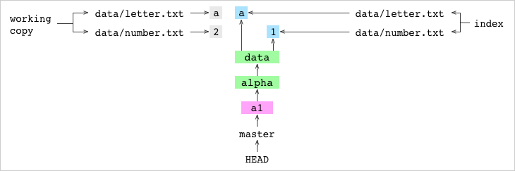
<div class="image-caption">`data/number.txt` set to `2` in the working copy</div>

```bash
~/alpha $ git add data/number.txt
```

The user adds the file to Git.  This adds a blob containing `2`.  And it updates the index with the hash of the new version of `data/number.txt`.

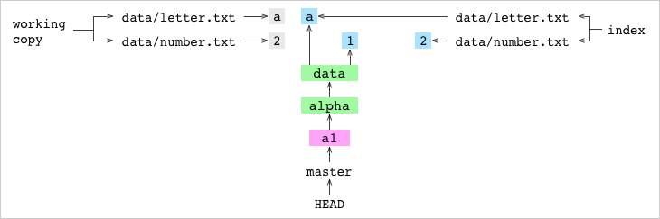
<div class="image-caption">`data/number.txt` set to `2` in the working copy and index</div>

```bash
~/alpha $ git commit -m 'a2'
          [master ae78f19] a2
```

The user commits.  The steps for the commit are the same as before.

First, a new tree graph is created to represent the content of the index.

A new tree object is created to represent the `data` directory.  This must be created because the hash of the content of the `data/number.txt` file has changed.

```
100664 blob 2e65efe2a145dda7ee51d1741299f848e5bf752e letter.txt
100664 blob d8263ee9860594d2806b0dfd1bfd17528b0ba2a4 number.txt
```

A new tree object is created to represent the `alpha` directory.  This must be created because the hash of the `data` tree object has changed.

```
040000 tree 40b0318811470aaacc577485777d7a6780e51f0b data
```

Second, a new commit object is created that points at the new tree object.

```
tree ce72afb5ff229a39f6cce47b00d1b0ed60fe3556
parent 30ec3334aaa3954ef44fb6b68cfbf1a225c3d5af
author Mary Rose Cook <mary@maryrosecook.com> 1424813101 -0500
committer Mary Rose Cook <mary@maryrosecook.com> 1424813101 -0500

a2
```

The second line of the commit object points at the commit's parent: `a1`.  To find the parent commit, Git went to `HEAD`, followed it to `master` and found the commit hash of `a1`.

Third, just like for the previous commit, the content of the `master` branch file is set to the hash of the new commit.

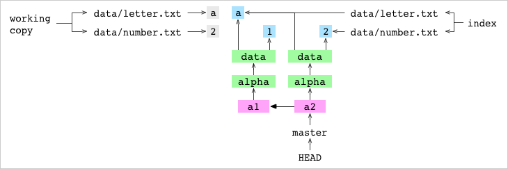
<div class="image-caption">`a2` commit</div>


<div class="image-caption">Git graph without the working copy and index</div>

Graph property: content is stored as a tree of objects.  Git's behavior: only diffs are stored in the objects database.  Look at the graph above.  The `a2` commit reuses the `a` blob that was made before the `a1` commit.  Similarly, if a whole directory doesn't change from commit to commit, its tree and all the blobs and trees below it can be reused.  Generally, there are few content changes from commit to commit.  This means that Git can store large commit histories in a small amount of space.

Graph property: each commit has a parent.  Git behavior: a repository stores the history of a project.  To see the history preceding a commit, move from parent to parent, all the way back to the first commit.

Graph property: the nodes in the graph are all text files.  Git behavior: the content in the nodes can be easily retrieved, edited, converted and explored with programs other than Git.

Graph property: refs are entry points to one part of the commit history or another.  Git behavior: commits can be given meaningful names.  The user uses concrete refs like `fix-for-bug-376` to organise their work into lineages that are meaningful to their project.  Symbolic refs like `HEAD`, `MERGE_HEAD` and `FETCH_HEAD` identify points in the commit history that are meaningful to Git.  These support commands that can manipulate the history: committing, merging, fetching.

Graph property: the nodes in the `objects/` directory are immutable.  Git behavior: content can be edited, not deleted.  Every piece of content ever added and every commit ever made is somewhere in the `objects` directory[^3].

Graph property: refs are mutable.  Git behavior: the meaning of a ref can change.  Though the commit that `master` points at now might be the best version of a project, soon enough, it will be superceded be a newer and better commit.

Graph property: refs and the working copy are readily available, but unreferenced commits are not. Git behavior: recent history is easier to recall, but more changeable.  Or: Git has a fading memory that must be jogged with increasingly vicious prods.

The working copy is the easiest point in history to recall because it is in the root of the repository.  Recalling it doesn't even require a Git command.  It is also the least permanent point in history.  The user can make a dozen versions of a file, but, unless they are added, Git won't record any of them.

The commit that `HEAD` points is very easy to recall.  It is at the tip of the branch that is checked out.  To see its content, the user can just stash[^4] and then examine the working copy.  At the same time, `HEAD` is the most frequently changing ref.

The commit that a concrete ref points at is easy to recall.  The user can simply check out that branch.  The tips of branches change less frequently that `HEAD`, but still frequently enough for them to be ephemeral.

It is possible to recall a commit that is not pointed at by any ref.  The further back the user goes, the harder it will be for them to sort through the content and reassemble the meaning of a commit in their human brain.  But, the further back they go, the less likely it is that someone will have changed history since they last looked[^5].

## Check out a commit

```bash
~/alpha $ git checkout 37888c2
          You are in 'detached HEAD' state...
```

The user checks out the `a2` commit using its hash.  Checking out has four steps.

First, Git gets the `a2` commit and gets the tree graph it points at.

Second, it writes the file entries in the tree graph to the working copy.  This results in no changes.  Because `HEAD` was already pointing (via `master`) at the `a2` commit, the working copy already has the same content as the tree graph being written to it.

Third, Git writes the file entries in the tree graph to the index.  This, too, results in no changes.  The index already has the same content as the `a2` commit.

Fourth, the content of `HEAD` is set to the hash of the `a2` commit:

```
37888c274ecb894b656829d55e88cd086c9b2f72
```

Setting the content of `HEAD` to a hash puts the repository in the detached `HEAD` state.  Notice that `HEAD` points directly at the `a2` commit in the graph below.


<div class="image-caption">Detached `HEAD`</div>

```bash
~/alpha $ printf '3' > data/number.txt
~/alpha $ git add data/number.txt
~/alpha $ git commit -m 'a3'
          [master 05f9ae6] a3
```

The user sets the content of `data/number.txt` to `3` and commits the change.  To get the parent of the `a3` commit, Git follows the detached `HEAD` directly to the hash of the previous `a2` commit, rather than going via a branch.

Git updates `HEAD` to point directly at the hash of the new `a3` commit.  This means that the repository is still in the detached `HEAD` state.  Because no commit points at either `a3` or one of its descendents, it is not on a branch.  This means it is easy to lose.


<div class="image-caption">`a3` commit that is not on a branch</div>

Note that, from now on, trees and blobs will mostly be omitted from the graph diagrams.

## Create a branch

```bash
~/alpha $ git branch deputy
```

The user creates a new branch called `deputy`.  This just creates a new file at `alpha/.git/refs/heads/deputy` that contains the hash that `HEAD` is pointing at.  That is, the hash of the `a3` commit.

Graph property: refs, like `deputy`, are just files.  Git behavior: it is computationally cheap to create and modify a file.  This is why Git branches are considered lightweight.

The creation of the `deputy` branch puts the new `a3` commit safely on a branch.  `HEAD` still points directly at a commit, so it is still detached.


<div class="image-caption">`a3` commit now on the `deputy` branch</div>

## Check out a branch

```bash
~/alpha $ git checkout master
          Switched to branch 'master'
```

The user checks out the `master` branch.

First, Git gets the `a2` commit that `master` points at and gets the tree graph the commit points at.

Second, Git writes the file entries in the tree graph to the files of the working copy.  This sets the content of `data/number.txt` to `2`.

Third, Git writes the file entries in the tree graph to the index.  The index becomes:

```
data/number.txt d8263ee9860594d2806b0dfd1bfd17528b0ba2a4
```

Fourth, Git points `HEAD` at `master` by changing its content from a hash to:

```
ref: refs/heads/master
```


<div class="image-caption">`master` checked out and pointing at the `a2` commit</div>

## Check out a branch that is incompatible with the working copy

```bash
~/alpha $ printf '789' > data/number.txt
~/alpha $ git checkout deputy
          Your changes to these files would be overwritten
          by checkout:
            data/number.txt
          Commit your changes or stash them before you
          switch branches.
```

The user accidentally sets the content of `data/number.txt` to `789`.  They try to check out `deputy`.  Git prevents the check out.

`HEAD` points at `master` which points at `a2` where `data/number.txt` reads `2`.  `deputy` points at `a3` where `data/number.txt` reads `3`.  The working copy version of `data/number.txt` reads `789`.    Because all these versions are different, checking out would require a merge.  For simplicity, Git does not allow check outs that require a merge.  Files in the working copy must either be new, or have the same content as the current commit, or have the same content as the commit being checked out.

```bash
~/alpha $ printf '2' > data/number.txt
~/alpha $ git checkout deputy
          Switched to branch 'deputy'
```

The user notices that they accidentally edited `data/number.txt` and sets the content back to `2`.  They check out `deputy` successfully.

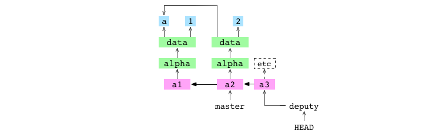
<div class="image-caption">`deputy` checked out</div>

## Merge an ancestor

```bash
~/alpha $ git merge master
          Already up-to-date.
```

The user merges `master` into `deputy`.  Merging two branches means merging two commits.  The first commit is the one that `master` points at: the giver.  The second commit is the one that `deputy` points at: the receiver.  For this merge, Git does nothing, reporting it is `Already up-to-date.`.

Graph property: the series of commits in the graph are interpreted as a series of changes made to the content of the repository.  Git behavior: if the giver commit is an ancestor of the receiver commit, Git will do nothing.  Those changes have already been incorporated.

## Merge a descendent

```bash
~/alpha $ git checkout master
          Switched to branch 'master'
```

The user checks out `master`.


<div class="image-caption">`master` checked out and pointing at the `a2` commit</div>

```
~/alpha $ git merge deputy
          Fast-forward
```

They merge `deputy` into `master`.  Git discovers that the receiver commit is an ancestor of the giver commit.  This means it can do a fast-forward merge.

It gets `a3`, the giver commit, and gets the tree graph that it points at.  It writes the file entries in the tree graph to the working copy and the index.  It "fast-forwards" `master` to point at `a3`.


<div class="image-caption">`a3` commit from `deputy` fast-forward merged into `master`</div>

Graph property: the series of commits in the graph are interpreted as a series of changes made to the content of the repository.  Git behavior: in a merge, if the giver is a descendent of the receiver, history is not changed.  There is already a sequence of commits that describe the change to make: the sequence of commits between the receiver and the giver.  But, though the Git history doesn't change, the Git graph does change.  The concrete ref that `HEAD` points at is pointed at the giver commit.

## Merge a commit from a different lineage

```bash
~/alpha $ printf '4' > data/number.txt
~/alpha $ git add data/number.txt
~/alpha $ git commit -m 'a4'
          [master c6b955e] a4
```

The user sets the content of `number.txt` to `4` and commits the change to `master`.

```bash
~/alpha $ git checkout deputy
          Switched to branch 'deputy'
~/alpha $ printf 'b' > data/letter.txt
~/alpha $ git add data/letter.txt
~/alpha $ git commit -m 'b3'
          [deputy d75b998] b3
```

The user checks out `deputy`.  They set the content of `data/letter.txt` to `b` and commit the change to `deputy`.


<div class="image-caption">`a4` committed to `master`, `b3` committed to `deputy` and `deputy` checked out</div>

Graph property: commits can share parents.  Git behavior: new lineages can be created in the commit history.

Graph property: commits can have multiple parents.  Git behavior: separate lineages can be joined by a commit with two parents: a merge commit.

```bash
~/alpha $ git merge master -m 'b4'
          Merge made by the 'recursive' strategy.
```

The user merges `master` into `deputy`.

Git discovers that the receiver, `b3`, and the giver, `a4`, are in different lineages.  It makes a merge commit.  This process has six steps.

First, Git writes the hash of the giver commit to a file at `alpha/.git/MERGE_HEAD`.  The presence of this file tells Git it is in the middle of merging.

Second, Git finds the base commit: the most recent common ancestor of the receiver and giver commits.

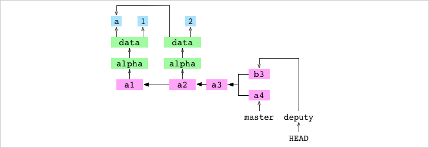
<div class="image-caption">`a3`, the base commit of `a4` and `b3`</div>

Graph property: commits have parents.  Git behavior: it is possible to find the point at which two lineages diverged.  Git traces backwards from `b3` to find all its ancestors and backwards from `a4` to find all its ancestors.  It finds the most recent ancestor shared by both lineages.  This is the base commit.

Third, Git generates the indices for the base, receiver and giver commits.

Fourth, Git generates a diff that contains the changes required to go from the content of the receiver commit to the content of the giver commit.  This diff is a list of file paths that point to a change: add, remove, modify or conflict.

Git gets the list of all the files that appear in at least one of the indices.  For each one, it compares the index entries to see what change was made to the file.  It writes a corresponding entry to the diff.  In this case, the diff has two entries.

The first is for `data/letter.txt`.  The content of this file is `a` in the base, `b` in the receiver and `a` in the giver.  The content is different in the base and receiver.  But it is the same in the base and giver.  This means that Git can see that the content was only modified by the giver, not the receiver.  Which means that the diff entry for `data/letter.txt` is a modification, not a conflict.

The second entry in the diff is for `data/number.txt`.  In this case, the content is the same in the base and receiver, and different in the giver.  This means that the diff entry for `data/letter.txt` is also a modification.

Graph property: it is possible to find the base commit of a merge.  Git behavior: if a file has changed from the base in just the receiver or giver, Git can automatically resolve the merge of that file.  This means less work for the user.

Fifth, the changes indicated by the entries in the diff are applied to the index.  This means that the entry for `data/letter.txt` is pointed at the `b` blob and the entry for `data/number.txt` is pointed at the `4` blob.

Sixth, the changes indicated by the entries in the diff are applied to the working copy.  This means that the content of `data/letter.txt` is set to `b` and the content of `data/number.txt` is set to `4`.

Seventh, the updated index is committed:

```
tree 20294508aea3fb6f05fcc49adaecc2e6d60f7e7d
parent d75b9983183df12a8e745318d0c31cc1782eaf2f
parent c6b955e6d3d26248112b29176d47b4186a9a20c8
author Mary Rose Cook <mary@maryrosecook.com> 1425596551 -0500
committer Mary Rose Cook <mary@maryrosecook.com> 1425596551 -0500

b4
```

Notice that the commit has two parents.

Eighth, Git points the current branch, `deputy`, at the new commit.

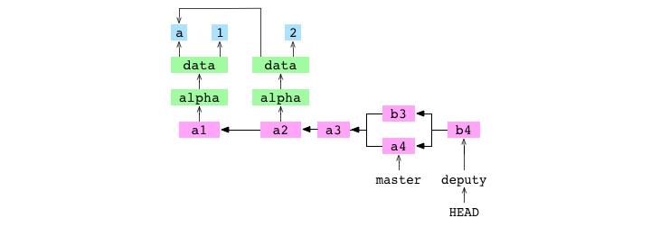
<div class="image-caption">`b4`, the merge commit resulting from the recursive merge of `a4` into `b3`</div>

## Merge two commits in different lineages that both modify the same file

```bash
~/alpha $ printf '5' > data/number.txt
~/alpha $ git add data/number.txt
~/alpha $ git commit -m 'b5'
          [deputy 15b9e42] b5
```

The user sets the content of `data/number.txt` to `5` and commits the change to `deputy`.

```bash
~/alpha $ git checkout master
          Switched to branch 'master'
~/alpha $ printf '6' > data/number.txt
~/alpha $ git add data/number.txt
~/alpha $ git commit -m 'b6'
          [master 6deded9] b6
```

The user checks out `master`.  They set the content of `data/number.txt` to `6` and commit the change to `master`.

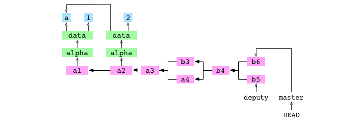
<div class="image-caption">`b6` commit on `master`</div>

```bash
~/alpha $ git merge deputy
          CONFLICT in data/number.txt
          Automatic merge failed; fix conflicts and then
          commit the result.
```

The user merges `deputy` into `master`.  There is a conflict and the merge is paused.  The process for a conflicted merge follows the same first six steps as the process for an unconflicted merge: set `alpha/.git/MERGE_HEAD`, find the base commit, generate the indices of the base, receiver and giver commits, create a diff, update the index and update the working copy.  Because of the conflict, steps four, five and six have different outcomes.  Because of the conflict, the seventh commit step and eighth ref update step are never taken.  Let's go through the steps again and see what happened.

First, Git writes the hash of the giver commit to a file at `alpha/.git/MERGE_HEAD`.

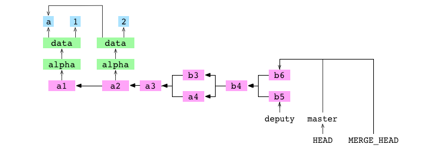
<div class="image-caption">`MERGE_HEAD` written during merge of `b5` into `b6`</div>

Second, Git finds the base commit.

Third, Git generates the indices for the base, receiver and giver commits.

Those steps are the same as before.

Fourth, Git creates a diff that contains the changes required to go from the receiver commit to the giver commit.  In this case, the diff contains only one entry: `data/number.txt`.  Because the content for `data/number.txt` is different in the receiver, giver and base, the entry is marked as a conflict.

Fifth, the changes indicated by the entries in the diff are applied to the index.  Entries in the index are uniquely identified by a combination of their file path and stage.  The entry for an unconflicted file has a stage of `0`.  Before this merge, the index looked like this, where `0` is the stage:

```
0 data/letter.txt 63d8dbd40c23542e740659a7168a0ce3138ea748
0 data/number.txt 62f9457511f879886bb7728c986fe10b0ece6bcb
```

After the merge diff is written to the index, the index looks like this:

```
0 data/letter.txt 63d8dbd40c23542e740659a7168a0ce3138ea748
1 data/number.txt bf0d87ab1b2b0ec1a11a3973d2845b42413d9767
2 data/number.txt 62f9457511f879886bb7728c986fe10b0ece6bcb
3 data/number.txt 7813681f5b41c028345ca62a2be376bae70b7f61
```

The entry for `data/letter.txt` at stage `0` is the same as it was before the merge.  The entry for `data/number.txt` at stage `0` is gone.  There are three new entries in its place.  The entry for stage `1` has the hash of the `data/number.txt` content from the base commit.  The entry for stage `2` has the hash of the `data/number.txt` content from the receiver commit.  The entry for stage `3` has the hash of the `data/number.txt` content from the giver commit.  The presence of these three entries tells Git that `data/number.txt` is in conflict.

Sixth, the changes indicated by the entries in the diff are applied to the working copy.  For a conflict, Git writes both versions to the file in the working copy.  The content of `data/number.txt` is set to:

```
<<<<<<< HEAD
6
=======
5
>>>>>>> deputy
```

The merge pauses here.

```bash
~/alpha $ printf '13' > data/number.txt
~/alpha $ git add data/number.txt
```

The user integrates the content of the two conflicting versions by setting the content of `data/number.txt` to `13`.  They add the file to the index.  Adding a conflicted file tells Git that the conflict is resolved.  Git removes the `data/number.txt` entries for stages `1`, `2` and `3` from the index.  It adds a blob containing the `13`, the new content of `data/number.txt`.  It adds adds an entry for `data/number.txt` at stage `0` with the hash of the new blob.  The index now reads:

```
0 data/letter.txt 63d8dbd40c23542e740659a7168a0ce3138ea748
0 data/number.txt ca7bf83ac53a27a2a914bed25e1a07478dd8ef47
```

```bash
~/alpha $ git commit -m 'b13'
          [master 28118a0] b13
```

Seventh, the user commits.  Git sees `alpha/.git/MERGE_HEAD` in the repository, which tells it that a merge is in progress.  It checks the index and finds there are no conflicts.  It creates a new commit, `b13`, to record the content of the resolved merge.  It deletes the file at `alpha/.git/MERGE_HEAD`.  This completes the merge.

Eighth, Git points the current branch, `master`, at the new commit.

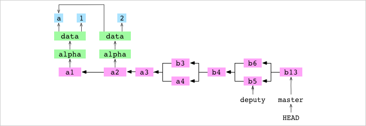
<div class="image-caption">`b4`, the merge commit resulting from the conflicted, recursive merge of `b5` into `b6`</div>

## Remove a file

A diagram of the Git graph that includes the trees and blobs for the current commit, the working copy and index:

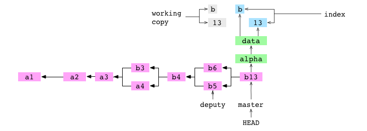
<div class="image-caption">`b13` commit with associated trees, and working copy and index</div>

```bash
~/alpha $ git rm data/letter.txt
          rm 'data/letter.txt'
```

The user tells Git to remove the `data/letter.txt` file.

First, `data/letter.txt` is deleted from the working copy.

Second, the entry for `data/letter.txt` is deleted from the index.

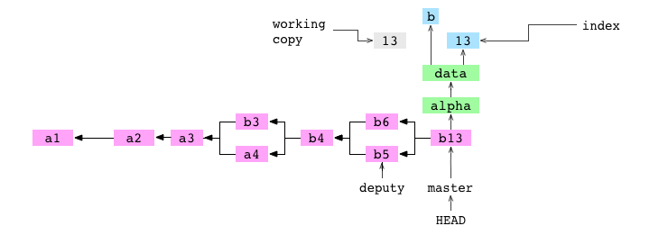
<div class="image-caption">After `data/letter.txt` `rm`ed from working copy and index</div>

```bash
~/alpha $ git commit -m '13'
          [master 836b25c] 13
```

The user commits.  As part of the commit, as always, Git builds a tree graph that represents the content of the index.  Because `data/letter.txt` is not in the index, it is not included in the tree graph.

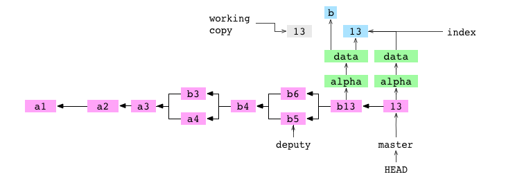
<div class="image-caption">`13` commit made after `data/letter.txt` `rm`ed</div>

## Copy a repository

```bash
~/alpha $ cd ..
      ~ $ cp -r alpha bravo
```

The user copies the contents of the `alpha/` repository to the `bravo/` directory.  This produces the following directory structure:

```
alpha
└── data
    └── letter.txt
    └── number.txt
bravo
└── data
    └── letter.txt
    └── number.txt
```

There is now another Git graph:

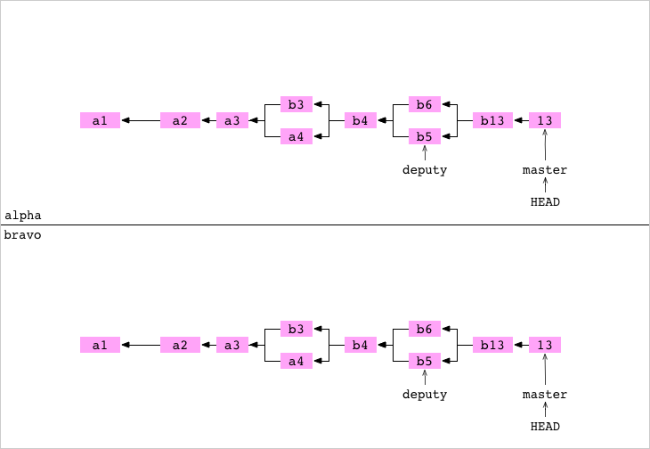
<div class="image-caption">New graph created when `alpha` `cp`ed to `bravo`</div>

## Link a repository ta another repository

```bash
      ~ $ cd alpha
~/alpha $ git remote add bravo ../bravo
```

The user moves back into the `alpha` repository.  They set up `bravo` as a remote repository on `alpha`.  This adds some lines to the file at `alpha/.git/config`:

```
[remote "bravo"]
	url = ../bravo/
```

These lines specify that there is a remote repository called `bravo` in the directory at `../bravo`.

## Fetch a branch from a remote

```bash
~/alpha $ cd ../bravo
~/bravo $ printf '14' > data/number.txt
~/bravo $ git add data/number.txt
~/bravo $ git commit -m '14'
          [master 6764cd8] 14
```

The user goes into the `bravo` repository.  They set the content of `data/number.txt` to `14` and commit the change to `master` on `bravo`.

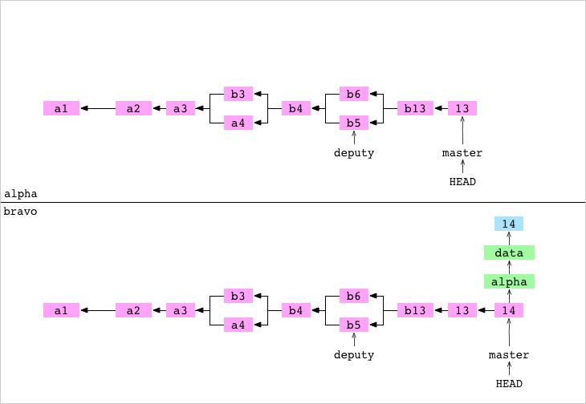
<div class="image-caption">`14` commit on `bravo` repository</div>

```bash
~/bravo $ cd ../alpha
~/alpha $ git fetch bravo master
          Unpacking objects: 100%
          From ../bravo
            * branch master -> FETCH_HEAD
```

The user goes into the `alpha` repository.  They fetch `master` from `bravo` into `alpha`.  This process has four steps.

First, Git gets the hash of the commit that master is pointing at on `bravo`.  This is the hash of the `14` commit.

Second, Git makes a list of all the objects that the `14` commit depends on: the commit itself, the objects in its tree graph, the ancestor commits of the `14` commit and the objects in their tree graphs.  It copies all the objects that are in this list but that `alpha` does not have to `alpha/.git/objects/`.

Third, the content of the concrete ref file at `alpha/.git/refs/remotes/bravo/master` is set to the hash of the `14` commit.

Fourth, the content of `alpha/.git/FETCH_HEAD` is set to:

```
132c6a5ba1bb9e0d89c45dc50ba4553f5edd19dc branch 'master' of ../bravo
```

This indicates that the most recent fetch command fetched the `14` commit of `master` from `bravo`.


<div class="image-caption">`alpha` after `bravo/master` fetched</div>

Graph property: objects can be copied.  Git behavior: history can be shared between repositories.

Graph property: a repository can store remote branch refs like `alpha/.git/refs/remotes/bravo/master`.  Git behavior: a repository can have a record of the state of a branch on a remote repository.  Though correct at the time it is fetched, it will go out of date if the remote branch changes.

## Merge FETCH_HEAD

```bash
~/alpha $ git merge FETCH_HEAD
          Updating 836b25c..6764cd8
          Fast-forward
```

The user merges `FETCH_HEAD`.  `FETCH_HEAD` is just another ref.  It resolves to the `14` commit, the giver.  `HEAD` points at the `13` commit, the receiver.  Git does a fast-forward merge and points `master` at the `14` commit.

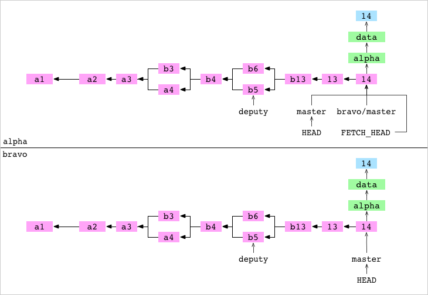
<div class="image-caption">`alpha` after `FETCH_HEAD` merged</div>

## Pull a branch from a remote

```bash
~/alpha $ git pull bravo master
          Already up-to-date.
```

The user pulls `master` from `bravo` into `alpha`.  Pulling is shorthand for fetching and merging `FETCH_HEAD`.  Git does these two commands and reports that `master` is `Already up-to-date`.

## Clone a repository

```bash
~/alpha $ cd ..
      ~ $ git clone alpha charlie
          Cloning into 'charlie'
```

The user moves into the directory above.  They clone `alpha` to `charlie`.  Cloning to `charlie` has similar results to the `cp` the user did to produce the `bravo` repository.  Git creates a new directory called `charlie`.  After that, it inits `charlie` as a Git repo, adds `alpha` as a remote called `origin`, fetches `origin` and merges `FETCH_HEAD`.

## Push a branch to a checked out branch on a remote

```bash
      ~ $ cd alpha
~/alpha $ printf '15' > data/number.txt
~/alpha $ git add data/number.txt
~/alpha $ git commit -m '15'
          [master 8b35db5] 15
```

The user goes back into the `alpha` repository.  They set the content of `data/number.txt` to `15` and commit the change to `master` on `alpha`.

```bash
~/alpha $ git remote add charlie ../charlie
```

They set up `charlie` as a remote repository on `alpha`.

```bash
~/alpha $ git push charlie master
          Writing objects: 100%
          remote error: refusing to update checked out
          branch: refs/heads/master because it will make
          the index and work tree inconsistent
```

They push `master` to `charlie`.

All the objects required for the `15` commit on the `master` branch are copied to `charlie`.

At this point, the push process stops.  Git, as ever, tells the user what went wrong.  It refuses to push to a branch that is checked out on the remote.  This makes sense.  A push will update the current commit and index of the remote.  This will cause confusion if someone is editing the working copy on the remote.

At this point, the user could make a new branch and push that branch to `charlie`.  But, really, they want a repository that they can push to whenever they want.  They want a central repository that they can push to and pull from, but that no one commits to directly.  They want something like a GitHub remote.  They want a bare repository.

## Clone a bare repository

```bash
~/alpha $ cd ..
      ~ $ git clone alpha delta --bare
          Cloning into bare repository 'delta'
```

The user clones `delta` as a bare repository.  This is an ordinary clone with two differences.  The `config` file indicates the repository is bare.  And the files that are normally stored in the `.git` directory are stored in the top of the repository:

```
delta
├── HEAD
├── config
├── objects
└── refs
```

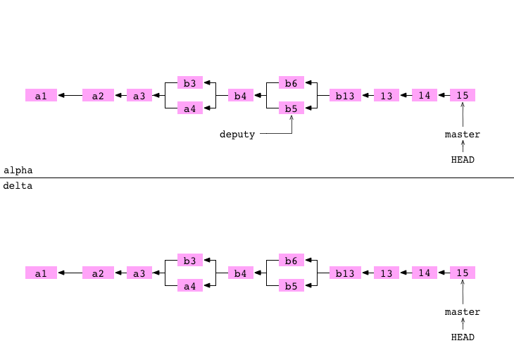
<div class="image-caption">`alpha` and `delta` graphs after `alpha` cloned to `delta`</div>

## Push a branch to a bare repository

```bash
      ~ $ cd alpha
~/alpha $ git remote add delta ../delta
```

The user goes back into the `alpha` repository.  They set up `delta` as a remote repository on `alpha`.

```bash
~/alpha $ printf '16' > data/number.txt
~/alpha $ git add data/number.txt
~/alpha $ git commit -m '16'
          [master 02d1bb2] 16
```

They set the content of `data/number.txt` to `16` and commit the change to `master` on `alpha`.

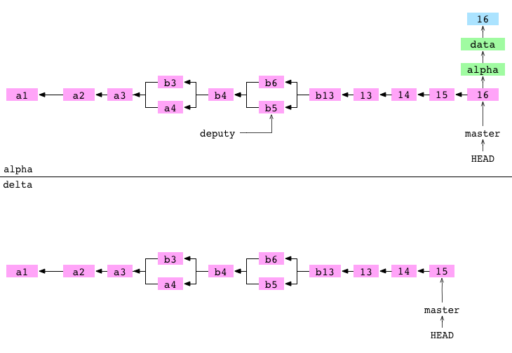
<div class="image-caption">`16` commit on `alpha`</div>

```bash
~/alpha $ git push delta master
          Writing objects: 100%
          To ../delta
            8b35db5..02d1bb2 master -> master
```

They push `master` to `delta`.  Pushing has three steps.

First, all the objects required for the `16` commit on the `master` branch are copied from `alpha/.git/objects/` to `delta/.git/objects/`.

Second, `refs/heads/master` is updated on `delta` to point at the `16` commit.

Third, `alpha/.git/refs/remotes/delta/master` is set to point at the `16` commit.  This means `alpha` has an up to date record of the state of `delta`.

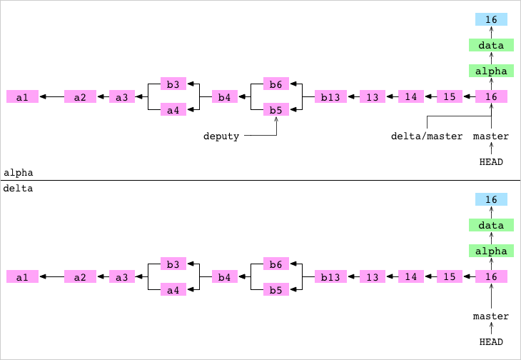
<div class="image-caption">`16` commit pushed from `alpha` to `delta`</div>

## Summary

Git is built on a graph.  Almost every Git command manipulates this graph.  To understand Git deeply, focus on the properties of this graph, not workflows or commands.

To learn more about Git, investigate the `.git` directory.  It's not scary. Look inside.  Change the content of files and see what happens.  Create a commit by hand.  Try and see how badly you can mess up a repo.  Then repair it.

[^1]: In this case, the hash is longer than the original content.  But, all pieces of content longer than the number of characters in a hash will be expressed more concisely than the original.

[^2]: There is a chance that two different pieces of content will hash to the same value.  But this chance <a href="http://crypto.stackexchange.com/a/2584">is low</a>.

[^3]: Content can be lost if the runs `git prune`.  This command deletes all objects that cannot be reached from a ref.

[^4]: `git stash` stores all the differences between the working copy and the current commit in a safe place from which they can be retrieved later.

[^5]: The `rebase` command can be used to add, edit and delete commits in the history.
